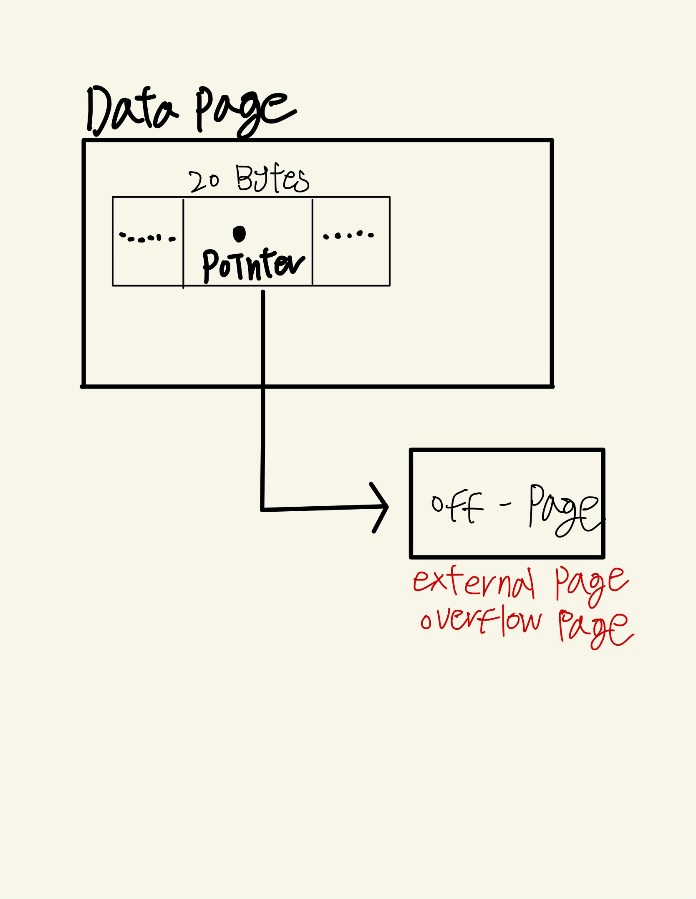

# VARCHAR VS TEXT
VARCHAR와 TEXT 타입의 공통점은 문자열 속성 값을 저장한다는 점과 최대 65,535 Bytes 까지 저장 가능하다는 점이고,  
차이점으로는  
- VARCHAR 타입 컬럼에는 지정된 글자 수 만큼만 데이터 저장이 가능하다. VARCHAR(10) -> 10글자 이하만 저장 가능 하다
- TEXT 타입 컬럼은 인덱스 생성 시 반드시 Prefix 길이 지정이 필요하다. CREATE INDEX ix_text_column ON table(text_column(100));
- TEXT 타입 컬럼은 표현식으로만 디폴트 값을 지정할 수 있다. 
CREATE TABLE tb1 (col TEXT DEFAULT 'abc') -> 에러  
CREATE TABLE tb1 (col1 TEXT DEFAULT('abc'')) -> 생성 가능

## 일반적인 사용형태와 효율적인 타입을 선택할때 고려 사항
일반적으로 길이가 짧으면 VARCHAR 타입, 길이가 길면 TEXT 타입을 사용하게 되는데, 길이가 짧다, 길다는 기준점이 모호하다.  
**그렇다면 VARCHAR(5000) 과 TEXT 타입이 있을떄 어떤 타입을 사용하면 좋을까?**  
VARCHAR 타입은 메모리 버퍼 공간을 미리 할당해두며 재활용이 가능하고, TEXT 타입은 그때그때 필요할 때마다 할당하고 해제한다. 컬럼 사용이 빈번하고 메모리 용량이 충분하다면 VARCHAR 타입을 사용하는 것이 좋다.  
VARCHAR(5000)과 같이 길이가 긴 컬럼들을 자주 추가하는 경우, Row 사이즈 제한(65,535 Byte)에 도달할 수 있으므로 적절하게 TEXT 타입과 같이 사용하는 것을 권장한다.  

길이가 그렇게 길지 않은 데이터가 들어갈 컬럼은 VARCHAR(30) 과 VARCHAR(255) 둘 중 어떤 값으로 설정해야할까 ?  
VARCHAR는 메모리 공간을 VARCHAR를 포함한 길이를 미리 할당하는 구조로 되어있기 때문에 실제 최대 사용하는 길이만큼 명시해야 메모리 사용 효율이 증가한다. 그리고 VARCHAR는 내부적으로 컬럼에 저장되는 데이터의 길이 정보를 저장하고 있기 때문에 이 정보를 저장하기 위해 지정된 길이에 따라 그 공간을 1Byte, 2Byte를 사용하게 된다. 그래서 길이를 설정할때 디스크 효율의 차이도 미미하게 발생할 수 있다.  

## VARCHAR & TEXT 주의사항
저장되는 값의 사이즈가 크면 Off-Page 형태로 데이터가 저장될 수 있다  
MySQL InnoStorage 엔진은 하나의 레코드 크기가 데이터 페이지 절반 크기보다 큰 경우에는 레코드에서 외부로 저장할 가변길이 컬럼을 선택하게되고 그렇게 선택된 컬럼은 별도의 외부 페이지에 데이터가 저장된다.  
실제 다른 컬럼들이 저장되어 있는 데이터 페이지에는 외부 페이지를 가리키는 20Bytes 짜리 포인터가 저장된다. 이렇게 외부에 저장되는 페이지를 external page 혹은 Overflow page라고 한다.
  

그리고 쿼리에서 Off-Page 컬럼의 참조 여부에 따라 쿼리 처리 성능이 매우 달라질 수 있다.  
처리 성능이 차이가 나는 이유는 off page까지 추가로 조회해야 하기 떄문이다. 
````sql
CREATE TABLE user_log(
    /* 테이블 생성 */
    id int NOT NULL  AUTO_INCREMENT,
    user_id int NOT NULL,
    extra_info text,
    PRIMARY KEY (id),
    KEY ix_userid (user_id)
)

/* 0.32 sec */
SELECT user_id, email, action_type 
FROM user_log
WHERE
 user_id = 7;

/* 1.23 sec */
SELECT user_id, email, action_type, extra_info
FROM user_log
WHERE
    user_id = 7;
````

## 정리
1. 상대적으로 저장되는 데이터 사이즈가 많이 크지 않고, 컬럼 사용이 빈번하며 DB 서버의 메모리 용량이 충분하다면 VARCHAR 타입을 권장하며, 저장되는 데이터 사이즈가 큰 편이고, 컬럼을 자주 사용하지 않으며 테이블에서 다른 문자열 컬럼들이 많이 사용되고 있는 경우 TEXT 타입을 권장한다.  
2. VARCHAR 타입을 사용하는 경우, 길이는 실제 사용되는 만큼만 지정하는것이 효율적이며, 쿼리의 SELECT 절에는 가능하면 필요한 컬럼들만 명시하고, 특히 사이즈가 너무 큰 컬럼은 SELECT 절에서 사용하지 않도록한다. 그렇지 않은 경우, 테이블에 대형 데이터 저장 컬럼 존재 시 쿼리 처리 성능이 떨어지고, 필요한 컬럼만 명시하면, 커버링 인덱스 방식으로 처리될 가능성이 높아진다.
