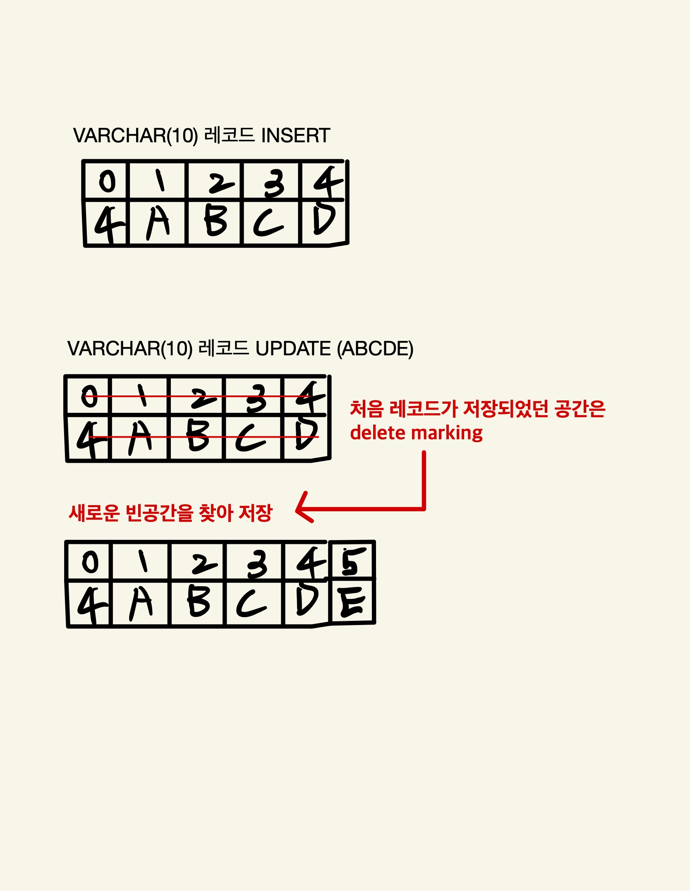

# CHAR VS VARCHAR
CHAR, VARCHAR 모두 문자열 저장용 컬럼으로 사용되며, 최대 저장 가능 문자 길이를 명시한다. 
두가지 타입의 차이점은 값의 실제 크기에 관계없이 고정된 공간 할당 여부를 결정하며 최대 저장 길이의 차이가 있다.

- **차이점**
- CHAR : 저장되는 문자열 길이의 상관없이 설정된 공간만큼 무조건 할당해서 사용하고 255 글까지만 사용할 수 있다.
- VARCHAR : 저장되는 문자열의 길이만큼만 공간을 할당하고, 16383 글자까지 사용할 수 있다.  
- VARCHAR와 가변 길이 문자셋을 사용하는 CHAR는 저장된 값에 대한 길이를 관리하며 0 ~ 255 bytes는 length-byttes : 1 로, 256 ~ 65535 bytes는 length-bytes : 2로 관리한다.  

## CHAR 타입의 공간 낭비
일반적으로 알고 있는 구분 기준은 고정된 길이의 값 저장은 CHAR 타입, 그 외의 경우 VARCHAR 타입을 사용해야한다. 라고 얘기를 한다.  
저장되는 문자열의 최소 최대 길이 가변 폭이 큰 경우에는 당연히 CHAR 타입을 사용하면 공간 낭비가 심하고, 문자열의 길이 가변 폭이 작은 경우에는 효율적일 수 있다.  
> 저장되는 값의 길이 변동이 크지 않다면 낭비는 그렇게 크지 않다.  
> -> 
> 가변폭이 그렇게 크지 않다면 VARCHAR가 아니라 CHAR로 사용해도 문제 없다.

## 컬럼 값의 길이 변경시 작동 방식
조금의 메모리 낭비도 하기 싫다고 전부 다 VARCHAR로 설정하면 안좋은 경우도 있다.  
예를들어 mysql서버는 VARCHAR(10)인 컬럼에 ABCD라는 값을 INSERT하는 경우에 지금 insert한 데이터가 몇 글자인지와, ABCD라는 값을 INSERT한다.  
ABCD로 insert한 데이터를 ABCDE로 업데이트 한다면 기존에 저장되어 있던 ABCD의 공간에 저장하지 못하게되는걸 감지하고, delete marking 처리한다. 그리고 새롭게 빈 공간에 ABCDE라는 레코드를 저장하게 된다.  
mysql 서버는 계속해서 CUD가 일어나게 되니, 새로운 공간을 찾는 작업은 점점 어려워진다.  
위에 예시처럼 VARCHAR가 아니라 CHAR로 사용한 컬럼이라면 이미 예약된 공간에 충분한 여유가 있어서 새로운 공간을 찾거나 하는 작업들이 불필요해진다.  
  
  

### fragmentation ? 
fragmentation 현상이란 데이터베이스의 데이터와 인덱스가 물리적으로 디스크에 저장될때 연속적으로 저장되지 않고, 여러 조각으로 나뉘어 저장되는 상태를 뜻한다.  
1. 데이터 조각화는 레코드가 삭제되거나 업데이트될 때 발생할 수 있으며 예를 들어, 레코드가 삭제되면 공간이 비어 있게 되고, 이후 새로운 레코드가 그 공간에 맞지 않으면 다른 곳에 저장되어 데이터가 조각화된다. 이런 빈 공간들이 많아지고 새로운 공간을 찾아 저장하는 과정에서 데이터의 읽기/쓰기 성능이 저하된다.
2. 인덱스 조각화는 인덱스 페이지가 꽉 차거나 비게 되면서 발생하는데 B-트리 구조의 인덱스에서 레코드가 추가되거나 삭제되면, 인덱스 페이지가 분할되거나 병합되면서 조각화가 발생한다. 인덱스가 조각화되면 인덱스 탐색 성능이 저하될 수 있다.  
  
이러한 문제를 해결하기위해 OPTIMIZE TABLE 명령어와 인덱스 구성을 재구성하여 조각화를 줄일 수 있다.  

### Page Reorganize ?
데이터베이스 관리 시스템에서 데이터 페이지나 인덱스 페이지를 재구성하여 조각화를 줄이는 작업을 의미한다.  
1. 페이지 병합 : 데이터 페이지에 작은 조각들이 흩어져 있을 때, 이를 하나의 페이지로 병합하여 빈 공간을 줄인다.
2. 페이지 분할 : 데이터가 많은 페이지를 적절한 크기로 나누어 효율적인 접근이 가능하도록 한다.  
3. 데이터 이동 : 데이터를 더 효율적인 위치로 이동시켜 페이지 내에서 연속적인 저장 공간을 확보한다.  

Page Reorganize 작업이 빈번한 경우 성능이 안좋은 점은 다음과 같다.
1. 추가적인 I/O 오버헤드 : 데이터를 정렬하고 재배치 하는 과정이기 떄문에 CPU 리소스의 소모가 많이 될 수 있다.  
2. 잠금과 경합 : Page Reorganize 작업 중에 테이블이나 인덱스가 잠길 수 있고, 이로 인해 다른 트랜잭션이 대기해야 한다.  
3. 쿼리 성능 저하 : 빈번하게 Page Reorganize 작업이 일어나는 경우, 쿼리의 실행 속도가 느려질 수 있다. 특히, 대용량 테이블이나 인덱스의 경우 Page Reorganize 자체의 작업이 오래 걸릴 수 있어 쿼리 성능에 영향을 미칠 수 있다.   

## 정리하자면,
1. VARCHAR 보다는 CHAR를 선택해야 하는 경우 : 값의 가변 길이 범위 폭이 좁고, 자주 변경되는 경우 (특히 인덱스된 컬럼인 경우)  
2. **1번과 같은 상황**에서 VARCHAR를 사용하게 되면 데이터 페이지 내부의 조각화 현상 (fragmentation 현상)이 심해지고, CHAR 타입보다 공간 효율이 떨어진다. 그리고 내부적으로 빈번한 Page Reorganize 작업이 필요해진다.